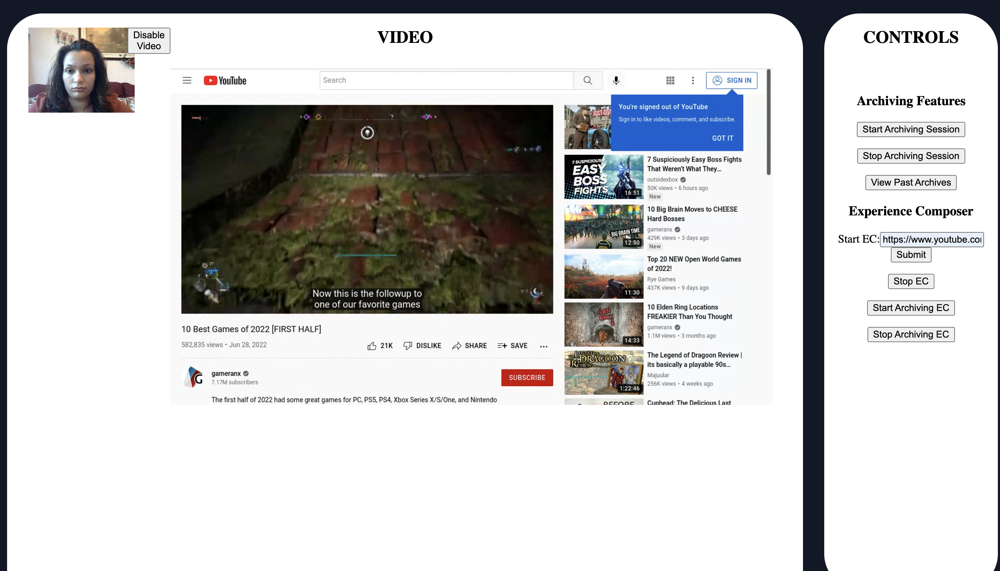

# Experience Composer Gamer Stream Sample Web Application

This sample application utilizes Vonage's Experience Composer. It is designed for a video game streamer to join an OpenTok session. Then the player will send the URL of their livestream to the server. By doing this, the streamer will act as the publisher with their video camera in the top left corner, and the Experience Composer stream will act as the subscriber which is displayed in the center.

In order to archive the web application including its CSS elements and layout in my sample app, a new session and new Experience Composer will need to be created by pressing the Start Archive EC button. This new Experience Composer will be directed to the URL of my website. The Experience Composer will subscribe to the new session which is being archived and can be accessed in the View Past Archives tab.

## Local Installation
1. Clone the repository

2. Install all dependencies: `npm install`

3. Add your own api key and api secret or add environment variables

4. Run the server side using: `npm run dev`

5. Run the client side using: `npm start`

Open https://localhost:3000 in web browser

